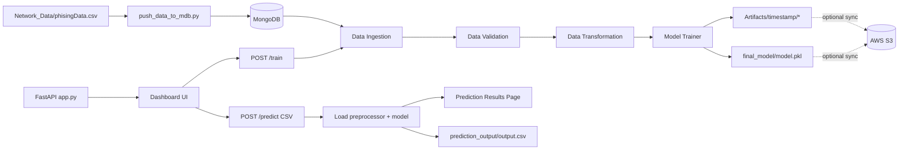

# Network Security ML Pipeline

This project is an end-to-end machine learning system for phishing and suspicious URL detection.

It supports:
- data loading into MongoDB
- model training through a modular pipeline
- prediction through a FastAPI web app
- local artifact management with optional S3 sync

## What This Project Does

The system takes tabular cybersecurity and URL-behavior features (for example URL length, SSL state, DNS record, redirects, iframe behavior, page rank) and predicts whether a record is suspicious or legitimate.

Main use cases:
- train and retrain a phishing detection model
- run batch predictions on uploaded CSV files
- support security analysis and early risk flagging

## Data Source and Input Type

Data used in this project is structured tabular data, not live web scraping.

Typical flow:
1. Dataset is stored in CSV format (example: Network_Data/phisingData.csv).
2. CSV is inserted into MongoDB using push_data_to_mdb.py.
3. Training pipeline reads data from MongoDB.
4. Model is trained and saved locally.
5. FastAPI app accepts CSV upload for prediction.

Schema reference is defined in data_schema/schema.yaml.

## Project Structure

- network_security/components: data ingestion, validation, transformation, trainer
- network_security/pipeline: orchestration of full training flow
- network_security/entity: config and artifact entities
- network_security/cloud: S3 sync utility
- templates: frontend pages for dashboard and prediction results
- Artifacts: timestamped outputs for each run
- final_model: trained model and preprocessing objects used by prediction

## Tech Stack

- Python
- FastAPI
- Pandas, NumPy, Scikit-learn
- MongoDB with PyMongo
- MLflow and DagsHub tracking
- Jinja2 templates for UI
- Optional AWS CLI + S3 for artifact sync

## Setup Instructions

### 1) Clone and move to project directory

Use your preferred git workflow and open this folder in VS Code.

### 2) Create and activate environment

Example (Windows):

python -m venv venv
venv\Scripts\activate

If using the existing environment in this project:

c:/Projects/Project2/mlenv2/python.exe -m pip install -r requirements.txt

### 3) Install dependencies

pip install -r requirements.txt

Important: file upload routes in FastAPI require python-multipart (already included in requirements.txt).

### 4) Configure environment variables

Create a .env file in project root with MongoDB connection values:

MONGO_DB_URL=<your_mongodb_connection_string>
MONGODB_URL_KEY=<your_mongodb_connection_string>

Notes:
- Data ingestion and data push scripts use MONGO_DB_URL.
- FastAPI app currently reads MONGODB_URL_KEY.

### 5) Load CSV data to MongoDB

python push_data_to_mdb.py

### 6) Run the app

python app.py

Open in browser:
- http://127.0.0.1:8000

## Frontend Usage

The web UI provides:
- a training button to run the full ML pipeline
- a CSV upload form for predictions
- a results page with prediction summary and full output table

## API Endpoints

- GET / : dashboard UI
- POST /train : runs end-to-end training pipeline
- POST /predict : accepts CSV file upload and returns rendered prediction results
- GET /docs : Swagger API documentation

## Local Run Without S3

S3 sync is optional and controlled by environment variable:

ENABLE_S3_SYNC=false

Default behavior is local-only (S3 sync disabled), so you can run everything without AWS credentials.

## Current Outputs

- training artifacts are saved under Artifacts/<timestamp>/...
- prediction CSV output is saved at prediction_output/output.csv
- final model artifacts are stored in final_model/

## Known Notes

- If port 8000 is already used, stop the process using that port or run on another port.
- In browser, use 127.0.0.1 or localhost (not 0.0.0.0).

## Roadmap

- improve validation and user-facing error handling in prediction upload
- strengthen configuration consistency for environment variables
- add tests for API routes and pipeline steps
- deployment hardening and observability improvements

## Architecture Diagram



	## Predict Request Sequence

	```mermaid
	sequenceDiagram
		participant U as User
		participant UI as Dashboard UI
		participant API as FastAPI /predict
		participant FS as File Parser (pandas)
		participant M as Preprocessor + Model
		participant R as Results Template

		U->>UI: Upload CSV and submit
		UI->>API: POST /predict (multipart/form-data)
		API->>FS: Read CSV into DataFrame
		API->>M: Load preprocessor.pkl + model.pkl
		M-->>API: Predicted labels
		API->>API: Append predicted_column
		API->>API: Save prediction_output/output.csv
		API->>R: Render table.html with summary
		R-->>U: Prediction results page
	```

## Deployment Update

This project is currently under active development.

Soon it will be deployed to Docker and Amazon EC2 for production-style hosting and easier environment portability.